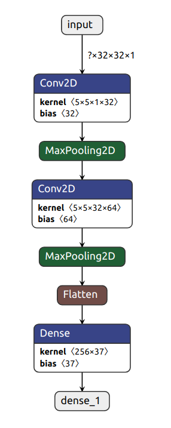

# Hindi Handwriting Recognition

### Description
This code successfully recognizes hindi characters.

### Dataset
Devanangiri Character Dataset can be found [here](http://archive.ics.uci.edu/ml/datasets/Devanagari+Handwritten+Character+Dataset "Dataset reference").

### Functionalities
1. Filters to detect hand.
2. CNN for training the model.

### Implementation
The model is made up of a neural network consisting of 2 convolutional networks followed by a dense layer.

### Model Architecture


### Result
* Train accuracy: ~95%
* Test accuracy: ~92%

### Getting started
* Clone the repository
* Download the dataset from [this](http://archive.ics.uci.edu/ml/datasets/Devanagari+Handwritten+Character+Dataset "Dataset reference") source.
* Run ```train_model.py``` to train the classifier on the downloaded dataset. A ```devanagari_model.h5``` model is saved which will be later used for making predictions.
* Run ```devanagari.py``` to predict results

### Steps in Command Line Interface
```shell
    git clone https://github.com/shrinidhi99/Hindi-Handwriting-Recognition.git
    python3 train_model.py
    python3 devanagari.py
```
### Some additional points
* Additional convolutional layers can be used
* Regularization can be added to prevent overfitting
* Additional images can be added to the training set for increasing the accuracy
### Preview

